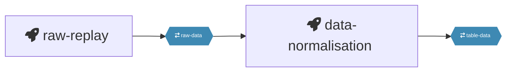

```mermaid
%%{ init: { 'flowchart': { 'curve': 'monotoneX' } } }%%
graph LR;
raw-replay[fa:fa-rocket raw-replay &#8205] --> raw-data{{ fa:fa-arrow-right-arrow-left raw-data &#8205}}:::topic;
raw-data{{ fa:fa-arrow-right-arrow-left raw-data &#8205}}:::topic --> data-normalisation[fa:fa-rocket data-normalisation &#8205];
data-normalisation[fa:fa-rocket data-normalisation &#8205] --> table-data{{ fa:fa-arrow-right-arrow-left table-data &#8205}}:::topic;


classDef default font-size:110%;
classDef topic font-size:80%;
classDef topic fill:#3E89B3;
classDef topic stroke:#3E89B3;
classDef topic color:white;
```